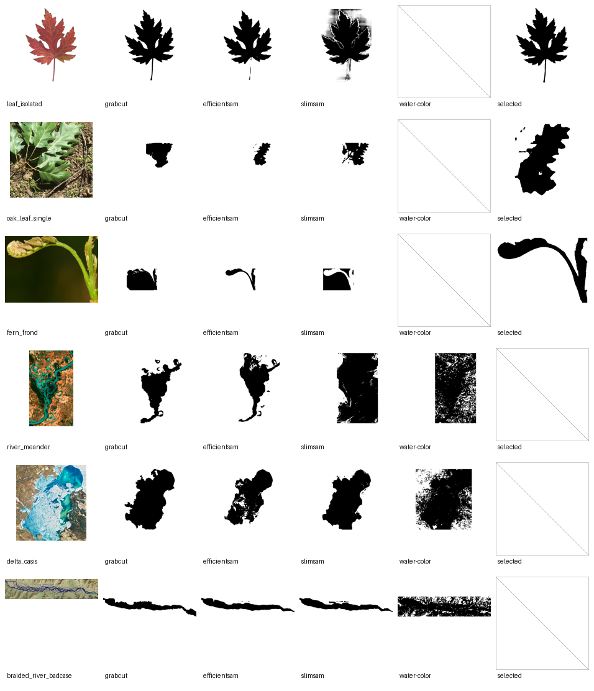
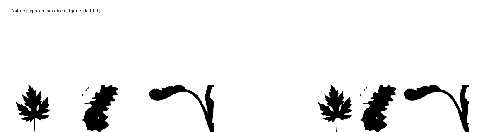

# Nature photo segmentation/font experiment

Date: 2026-09-10

This is a real-photo qualitative experiment for ornament/symbol glyphs, not an automatically generated readable A-Z alphabet. The generated font maps only reviewed-good nature silhouettes to manually chosen characters (`L`, `B`, `F`) so they can be typed in a proof image; river/delta probes are retained as failures, not font successes.

## Reproduce

From the repository root:

```bash
.venv/bin/python scripts/experiment_nature_fonts.py --download-sources --output-dir output/nature-experiments
```

If `output/nature-source-images/` is already populated, omit `--download-sources`. The script verifies source-image SHA-256 values from `docs/research/nature-source-manifest.json` and writes all generated experiment artifacts under ignored `output/nature-experiments/`.

Key generated artifacts:

- Report JSON: `../../output/nature-experiments/nature-experiment-report.json`
- Contact sheet: `../../output/nature-experiments/contact-sheet.png`
- Typed proof image: `../../output/nature-experiments/font-proof.png`
- Font files: `../../output/nature-experiments/NatureGlyphs/NatureGlyphs.ttf`, `../../output/nature-experiments/NatureGlyphs/NatureGlyphs.otf`
- Standalone selected masks: `../../output/nature-experiments/selected-glyphs/*.png` and `../../output/nature-experiments/selected-glyphs/*.svg`





## Scope and source rights

- Inputs are real photos/satellite images, but there is no hand-labeled ground truth. Metrics in the report are mask diagnostics/topology/timing only; they are not accuracy claims.
- Source provenance and license fields are maintained in `docs/research/nature-source-manifest.json`.
- The isolated maple leaf source is CC BY-SA 3.0 and requires attribution/share-alike handling if redistributed as adapted material.
- The branch/fern sources are recorded as CC0. Satellite sources are recorded as public-domain NASA/USGS-style sources with no endorsement implied.

## Methods run

All methods ran sequentially in one process; no parallel model inference was used.

- `grabcut` — existing local OpenCV GrabCut baseline with normalized rectangle only.
- `efficientsam` — existing EfficientSAM box runner.
- `slimsam` — fp32 SlimSAM runner with explicit normalized keep/exclude points.
- `water-color` — deterministic satellite-water helper for river/delta cases only. It samples LAB color around explicit keep points, unions `distance < 24`, a blue/green HSV rule, and a dark-channel rule inside the crop, then removes components under 24 pixels. It does not keep only the largest component.

## Executed cases and review outcome

| Case | Glyph | Source id / file | Rect `(l,t,r,b)` | Points | Selected | Review outcome |
| --- | --- | --- | --- | --- | --- | --- |
| `leaf_isolated` | `L` | `isolated_leaf__Autumn_Silver_Maple_Leaf.jpg` | `(0.033576, 0.023562, 0.970901, 0.9839)` | 5 keep, 1 exclude | GrabCut | Accepted; preserved the leaf lobes cleanly. |
| `oak_leaf_single` | `B` | `whole_branch__Small_oak_branch.jpg` | `(0.46, 0.30, 0.78, 0.69)` | 3 keep, 2 exclude | EfficientSAM | Accepted as an abstract single-leaf symbol after narrowing from the cluttered whole branch. |
| `fern_frond` | `F` | `fern_thin_structure__Close-up_of_Emerging_Fern_Frond_in_Spring.jpg` | `(0.05, 0.427778, 0.654167, 0.713889)` | 4 keep, 2 exclude | EfficientSAM | Accepted; thinner stem survives better than the broad GrabCut/SlimSAM candidates. |
| `river_meander` | `M` | `satellite_meander__Meandering_Mississippi_5182095595.jpg` | `(0.378788, 0.035014, 0.918911, 0.959398)` | 5 keep, 2 exclude | None | Rejected for the font: methods produced river-adjacent blobs/noisy masks rather than a recognizable river glyph. |
| `delta_oasis` | `D` | `satellite_delta_oasis__A_Delta_Oasis_in_Southeastern_Kazakhstan.jpg` | `(0.123869, 0.05717, 0.862315, 0.855169)` | 4 keep, 2 exclude | None | Rejected for the font: broad basin masks were too blob-like and not a reliable water/ice class extraction. |
| `braided_river_badcase` | `R` | `satellite_braided__Braided_River_in_Tibet_Redraws_Its_Channels_154747.jpg` | `(0.0, 0.3375, 1.0, 0.725)` | 4 keep, 2 exclude | None | Explicitly rejected and left out of the font due text/map artifacts and unresolved channel class ambiguity. |

The full JSON report records every normalized point, method timing, mask topology, coverage, warnings, selected artifact paths, and source-file verification status.

## Findings

- ML was useful when the object was in clutter or thin structure mattered: EfficientSAM produced the accepted oak-leaf and fern candidates.
- GrabCut still won the simple high-contrast isolated leaf.
- SlimSAM fp32 ran successfully with real weights and explicit points, but in these cases it often selected too broadly or created noisy/high-component masks; it was not selected for the font subset.
- River and delta experiments are honest failures at the current quality bar. They remain in the report/contact sheet for inspection, but are excluded from the font.
- The deterministic `water-color` helper is not ready to expose as a core/app feature. It avoided polarity inversion (`0 = foreground`, `255 = background`) but still produced noisy high-hole masks on meander/delta/braided scenes. Current parameters were LAB sample radius 3 px, LAB distance `< 24`, HSV hue `72..112`, saturation `>=45`, value `>=55`, plus dark-channel `v < 65`, and min component area `24`.
- The generated font is useful as a reviewable ornament font proof, not as proof that nature shapes can automatically become legible alphabet glyphs or that rivers/deltas were solved.

## Output contract checked

- Actual masks use the repo convention: black foreground, white background.
- Selected masks are exported as standalone PNG and SVG for inspection.
- The font build uses `build_font_from_masks`; selected masks are cropped/resized with tiny-speck cleanup only. No AI-generated shape completion or style synthesis is applied.

## Retained evidence

Small reviewed outputs are retained under [nature-evidence](nature-evidence/README.md), including attribution and adaptation licensing. Full source photographs, models, and reproducible font binaries remain ignored. Eight images were sourced; six cases were executed.


## Follow-on river work

The [guided river follow-on](river-evidence/README.md) retains a four-source/six-method baseline plus one derived Mississippi channel refinement. The broad initial blob was rejected; the narrower16-point seeded-color trace remains diagnostic-only, including an actual-font fidelity check. It does not supersede the rejection of automatic river extraction above.
