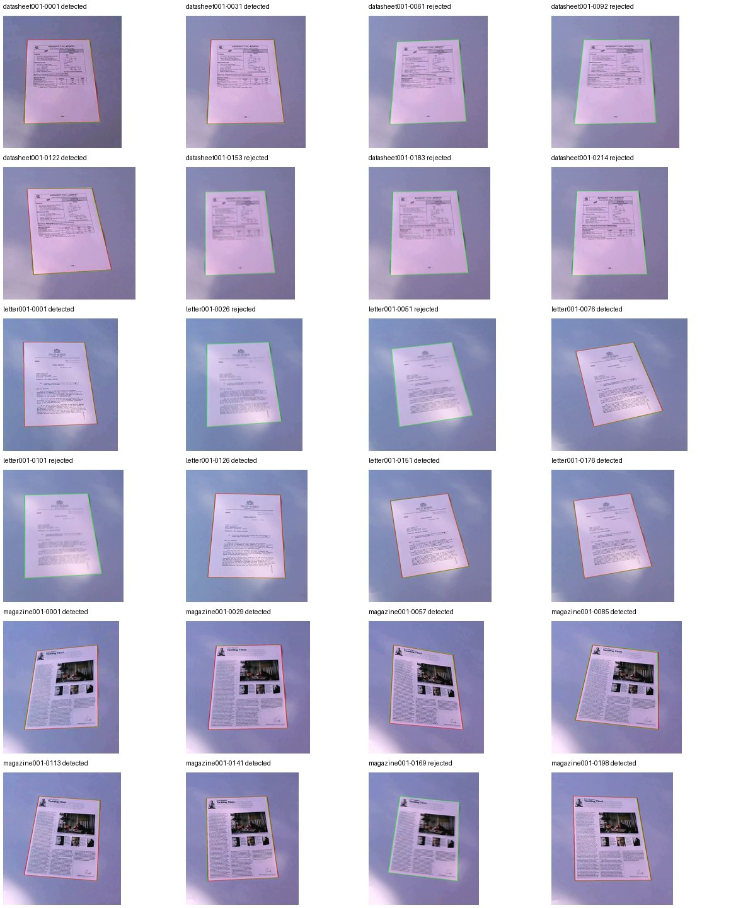

# Safer automatic page-corner suggestions — 2026-09-10

## What shipped locally

- Candidate quads must agree with the observed contour area and have image-edge support on all four sides. A minimum-area rotated rectangle around a curved object is no longer enough.
- Overlapping candidates are deduplicated; similarly plausible distinct pages produce a request for manual corners rather than an arbitrary selection.
- The automatic page-area minimum remains **18%**. Manual corners remain available, and automatic suggestions still require user confirmation. These geometric heuristics do not recognize template identity, prove paper flatness, or determine reading orientation.
- Frontend request/source tokens prevent late detector responses from overwriting a replaced sheet, changed mode/project, or manually edited/confirmed corners. A superseded upload cannot become the current sheet upload reference.

## Before / after evidence

| Fixed cohort | Before | After |
|---|---|---|
| 24 original SmartDoc frames | 1 wrong suggestion, 23 rejections | 0 suggestions, 24 rejections |
| 24 reference-centered derived crops | 16 suggestions: 13 IoU ≥ .90, 3 below .90; 8 rejections | 15 suggestions, all IoU ≥ .90; 9 rejections |

[Before report](before/report.json) / [after report](after/report.json). A .90 polygon-IoU threshold is a diagnostic, not a release guarantee. Rejections remain in denominators: crop mean IoU across all 24 cases fell from **0.6328 to 0.6176**, even as wrong suggestions fell and the count above .90 increased from 13 to 15. Do not hide this tradeoff or present zero wrong suggestions as universal accuracy.

**Not 48 independent phone captures:** both cohorts come from the same 24 frames of three already-seen clips. All originals have page area below the app's minimum. Derived crops use the published reference bounding box, expanded 28% per side, removing background/clutter using oracle information. They test geometry under a different apparent page-area constraint; they do not simulate moving a phone, provide new optical detail, or establish untouched held-out performance.



## Tests and runtime checks

- Four controlled rejection cases failed before the detector change and passed after; one controlled perspective/shadowed-page positive remained accepted. Existing markerless tests pass. Controls cover curved objects, occlusion/partial page and two similarly plausible pages, not every real distractor.
- Three frontend regressions reproduce late-result races against manual corner edits, sheet replacement and mode change, then pass with request guards.
- `scripts/smoke_page_corners_browser.cjs` exercises real local UI → upload → API detection using a synthetic template-on-desk positive and a synthetic ellipse rejection. It checks mandatory confirmation and available manual fallback; it does not build a font or measure real-phone accuracy. [Recorded run](browser-report.json): actual API200 on the page, rejection on the ellipse, and no browser JavaScript errors.

## Reproduce

```sh
# Run the existing licensed collector/benchmark first if originals are absent:
.venv/bin/python scripts/benchmark_real_pages.py --download --output-dir output/page-source-baseline
.venv/bin/python scripts/benchmark_page_constraints.py --output-dir output/page-corner-current
.venv/bin/python -m pytest tests/test_page_detection_quality.py tests/test_page_constraint_benchmark.py tests/test_alignment_markerless.py
# With the current local API8011 / production web3011 running:
node scripts/smoke_page_corners_browser.cjs
```

Sources are hash-checked against the retained original manifest. Before predictions were frozen before edits; after results run the changed detector. No page detector/model was trained.

## Attribution and method references

Frames/crop illustrations are adaptations of [ICDAR2015 SmartDoc sample dataset](https://zenodo.org/records/1230218), **CC BY 4.0**: Burie, Chazalon, Coustaty, Eskenazi, Luqman, Mehri, Nayef, Ogier, Prum, Rusinol, *ICDAR2015 Competition on Smartphone Document Capture and OCR (SmartDoc)*. Pinned archive hash and exact source/annotation hashes are in the original [source report](../real-page-evidence/report.json). No endorsement implied.

Implementation uses existing [OpenCV contour/shape operations](https://docs.opencv.org/4.x/d3/dc0/group__imgproc__shape.html). Geometric thresholds are heuristic support gates, not calibrated confidence probabilities.

## Still needed

In-spec physical printed-template phone photos across lighting, surfaces, rotation and device models; real absent-page/rectangular-distractor scenes; user correction-time/retake burden. Glare, page curl and near-white backgrounds can still require manual corners or a retake. Do not remove the confirmation step based on this small corpus.

## Final validation summary

Full Python run177 passed/31 database-dependent skips; separate disposable PostgreSQL16 run43 passed covering those database paths (container removed); final page/alignment/API targeted suite48 passed and markerless/guided font/page-control suite19 passed (overlapping tests). Web121 passed, typecheck/build passed, lint0 errors/7 existing warnings; production-preview Chromium14 passed. Independent review cleared detector and async UI changes. See [central validation record](../../VALIDATION.md) for database-path checks and remaining hosted/device gates.
